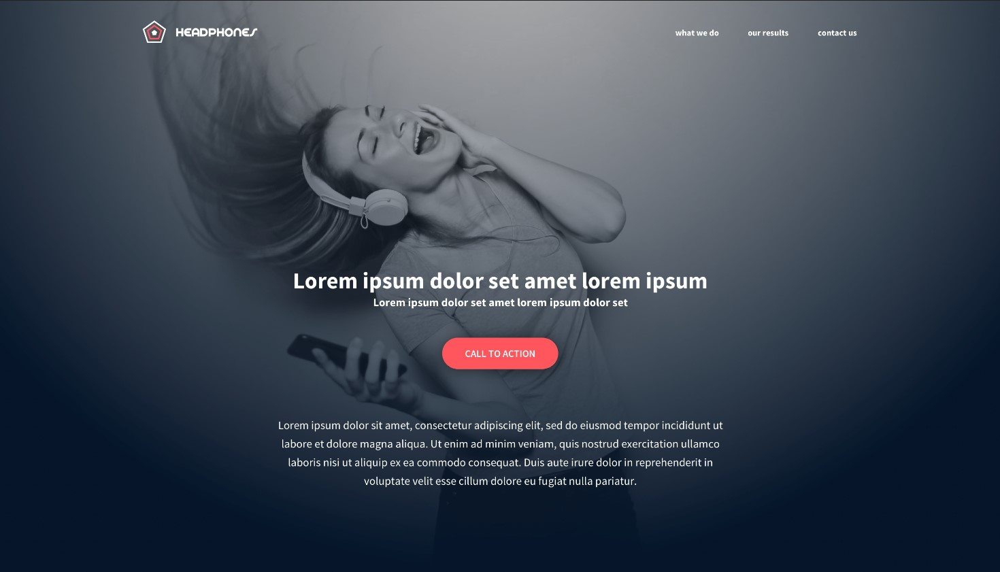

# holberton-headphones

> Implement a design from scratch

## Description:bulb:
Implement from scratch, without any library, a web page using all HTML/CSS/Accessibility/Responsive design knowledges learned previously.

The objective is simple: Have a fully functional web page that looks the same as the designer file.

> This webpage has been designed by Nicolas Philippot, UI/UX designer. 

## Project Notes:books:
* Be familiar with Figma.
* Reset CSS styling.
* Use variables.
* Simple CSS selectors.
* Simple HTML structure.

## Author
* **Diego Monroy** - [diegozencode](https://github.com/diegozencode) - [twitter:speech_balloon:](https://twitter.com/diegozencode)
